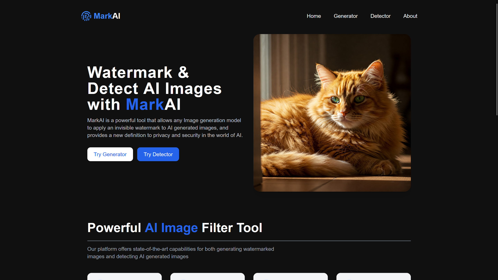
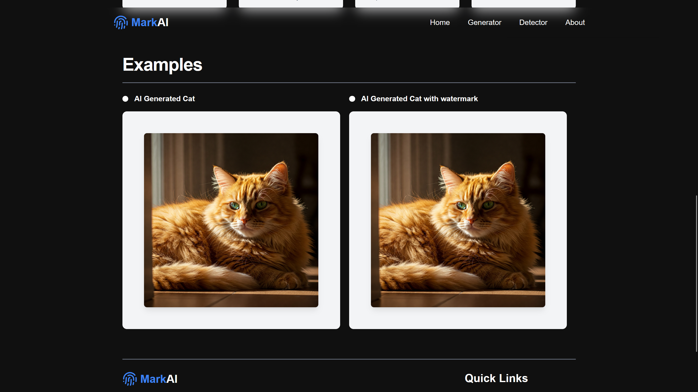
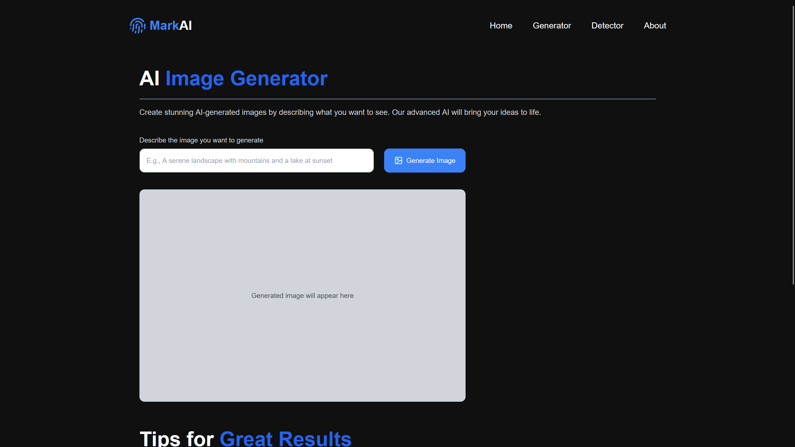
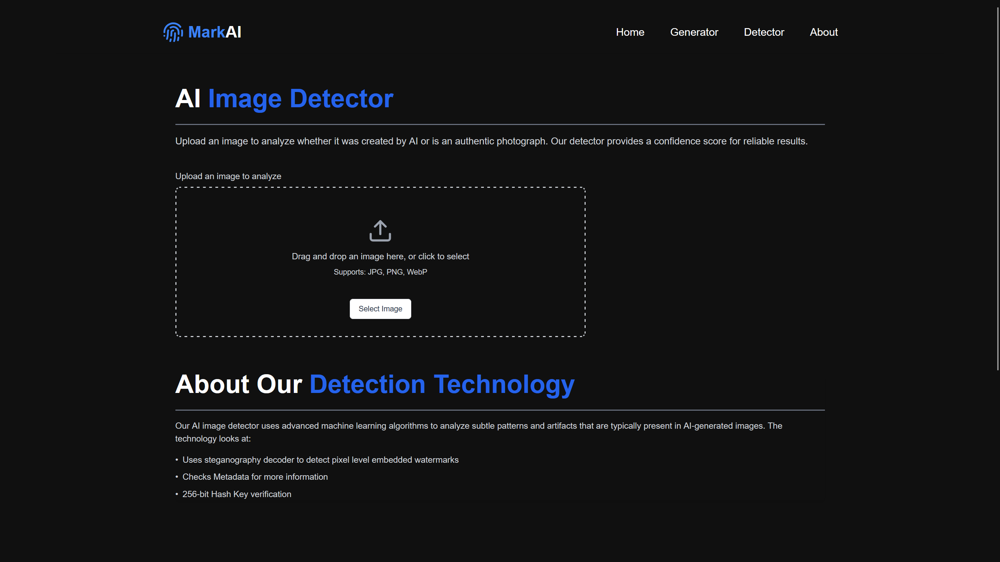

# MarkAI

Invisible Watermarking & Detection for AI-Generated Images



---

## Overview
MarkAI is a lightweight toolchain that lets any image generation model embed a robust, invisible digital watermark into its output. Later, you can feed the watermarked (or any suspect) image into our detector to reliably flag whether it was generated by MarkAI-enabled AI.



## Features
- Invisible, spread-spectrum watermark in the frequency domain  
- No visible artifacts or quality loss  
- Fast, client- or server-side embedding & detection  
- React+Vite+Tailwind front end for prompt→generate→download  
- Detector API for "AI-Generated" / "Original" classification  



## Tech Stack
- **Front End**: React, Vite, TypeScript, Tailwind CSS, Framer Motion  
- **Back End**: Python, Flask, OpenCV, PyTorch, Diffusers (Stable Diffusion)  
- **Watermarking**: Custom spread-spectrum embedding  
- **Detection**: Binary classifier on extracted watermark signature  



## Getting Started

### Prerequisites
- Node.js ≥16  
- Python ≥3.8  
- pip  

### Installation
1. Clone the repo  
   ```bash
   git clone https://github.com/your-org/MarkAI-NMITHacks.git
   cd MarkAI-NMITHacks
   ```
2. Install all dependencies (front-end and back-end)
   ```bash
   npm run install-all
   ```
   This will:
   - Install root dependencies
   - Install frontend dependencies
   - Install backend Python requirements

### Running the App
1. Start both frontend and backend servers with a single command:
   ```bash
   npm run dev
   ```
   Or run them separately:
   - Frontend only: `npm run frontend`
   - Backend only: `npm run backend`

2. Open [http://localhost:5173](http://localhost:5173) in your browser.


## Contributing
We welcome contributions! Please read our [contributing guidelines](CONTRIBUTING.md) before submitting a pull request.

## License
This project is licensed under the MIT License - see the [LICENSE](LICENSE) file for details.

---

Made with ❤️ by the MarkAI team


